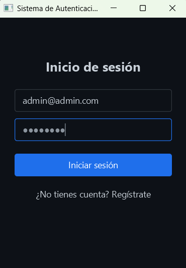
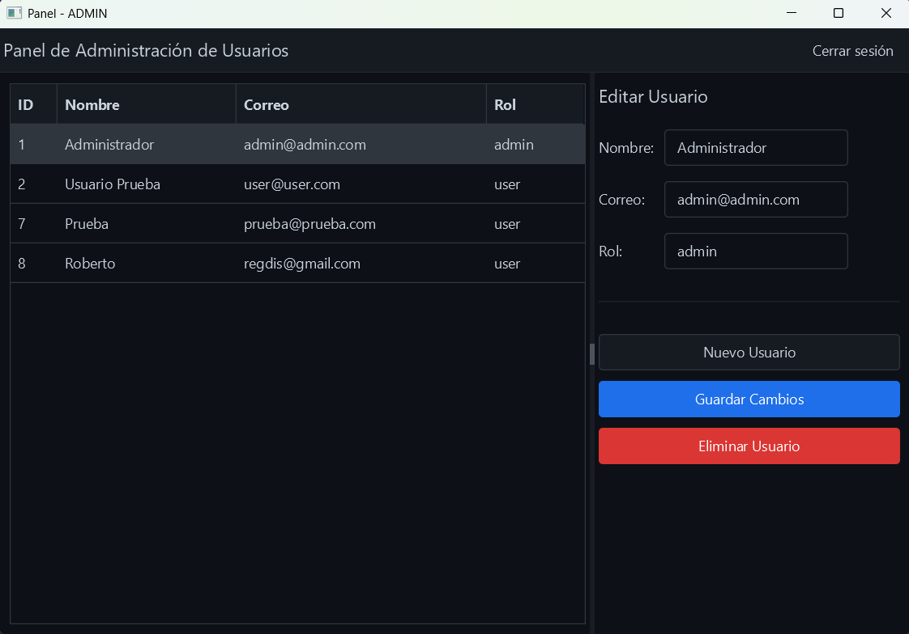

# Sistema de Autenticación en Java (JavaFX + MySQL)

Este proyecto es una aplicación de escritorio desarrollada en **Java** utilizando **JavaFX** y una arquitectura **MVC**, que permite autenticación de usuarios con distintos roles (`admin` y `user`).

## 🔐 Funcionalidades

- Login funcional con validación y encriptación de contraseñas.
- Contraseñas cifradas con BCrypt.
- Registro de nuevos usuarios con hash de contraseña.
- Redirección a vistas según el rol del usuario (`admin` o `user`).
- Interfaz visual construida con JavaFX + SceneBuilder.
- Conexión a base de datos MySQL.
- Panel de administración (solo para `admin`) con funcionalidades completas de CRUD:
    - 📋 Listar usuarios.
    - ✏️ Editar nombre, correo y rol.
    - 🗑️ Eliminar usuarios.
    - ➕ Crear nuevos usuarios con contraseña temporal cifrada.

## 🖼️ Capturas de pantalla

### Login



### Panel de Administración



## 🧰 Tecnologías utilizadas
- Java 23
- JavaFX 20
- Maven
- MySQL
- BCrypt (`jbcrypt`)
- SceneBuilder (FXML)

## 🗂️ Estructura del proyecto

```
src/
└── main/
    ├── java/
    │   └── auth/
    │       ├── controller/
    │       ├── model/
    │       ├── service/
    │       └── util/
    └── resources/
        ├── login.fxml
        ├── dashboard_admin.fxml
        └── dashboard_user.fxml
```

## ⚙️ Configuración

1. Clona el repositorio:
```bash
git clone https://github.com/REGGDIS/auth-system-java.git
```

2. Importa el proyecto en IntelliJ IDEA como proyecto Maven.

3. Configura la base de datos MySQL:

```sql
CREATE DATABASE sistema_usuarios;

CREATE TABLE usuarios (
  id INT AUTO_INCREMENT PRIMARY KEY,
  nombre VARCHAR(100),
  correo VARCHAR(100) UNIQUE,
  contrasena VARCHAR(255),
  rol ENUM('admin', 'user') NOT NULL
);

INSERT INTO usuarios (nombre, correo, contrasena, rol) VALUES
('Administrador', 'admin@admin.com', '$2a$10$L3QDM1fsU1Y4eyEV.jyZLOEqCsrSM/q4FQlpMG0NUAlfjL7gzN7d2', 'admin'),
('Usuario Prueba', 'user@user.com', '$2a$10$xXFbdfeY6/hmn8ChO5Pfn.NGzJO3fZ5WEfePyxVptlGQMeMtCyJk.', 'user');
```

4. Ejecuta la app desde IntelliJ con el comando:
```
javafx:run
```

## 🙋 Autor
**Roberto Emilio González Guzmán**  
Estudiante de Ingeniería Informática.  
📫 regdis@gmail.com