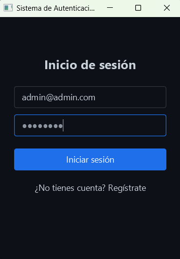
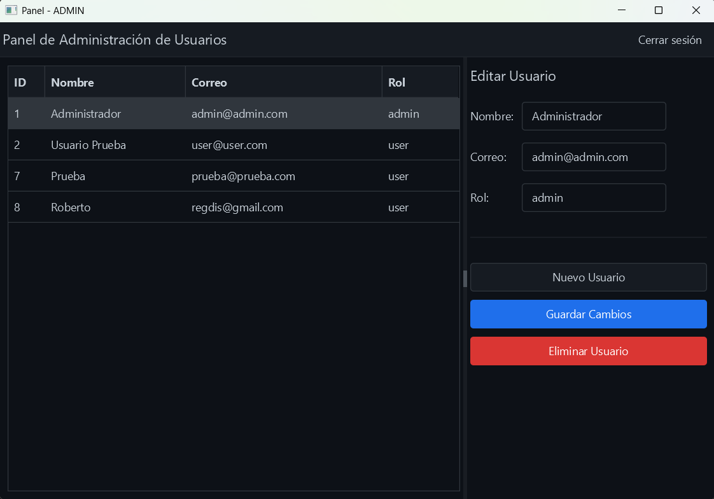

# Sistema de Autenticación en Java (JavaFX + MySQL)

Este proyecto es una aplicación de escritorio desarrollada en **Java** utilizando **JavaFX** y una arquitectura **MVC**, que permite autenticación de usuarios con distintos roles (`admin` y `user`).

## 🔐 Funcionalidades

- **Modern UI**: Interfaz visual renovada con el tema **PrimerDark** de **AtlantaFX**.
- **Arquitectura Service/DAO**: Lógica de negocio desacoplada de los controladores para mayor mantenibilidad.
- **Navegación Centralizada**: Uso de `SceneManager` para gestionar transiciones entre vistas de forma eficiente.
- **Conexión Robusta**: Implementación de pool de conexiones con **HikariCP**.
- **Seguridad**: Contraseñas cifradas con BCrypt y soporte para credenciales mediante variables de entorno.
- **CRUD Completo (Admin)**: Gestión integral de usuarios con validaciones modernas.
- **Logging**: Sistema de trazas implementado con **SLF4J + Logback**.

## 🖼️ Capturas de pantalla

### Login


### Panel de Administración (Modernizado)


## 🧰 Tecnologías utilizadas
- **Java 23** (LTS)
- **JavaFX 20** (OpenJFX)
- **AtlantaFX** (Modern CSS Framework)
- **HikariCP** (Connection Pooling)
- **MySQL** (Persistence)
- **BCrypt** (Security)
- **JUnit 5 / Mockito** (Testing)
- **SLF4J / Logback** (Logging)
- **Maven** (Dependency Management)

## 🗂️ Estructura del proyecto

```
src/
└── main/
    ├── java/
    │   └── auth/
    │       ├── controller/
    │       ├── model/
    │       ├── service/
    │       └── util/
    └── resources/
        ├── login.fxml
        ├── dashboard_admin.fxml
        └── dashboard_user.fxml
```

## ⚙️ Configuración

1. Clona el repositorio:
```bash
git clone https://github.com/REGGDIS/auth-system-java.git
```

2. Importa el proyecto en IntelliJ IDEA como proyecto Maven.

3. Configura la base de datos MySQL:

```sql
CREATE DATABASE sistema_usuarios;

CREATE TABLE usuarios (
  id INT AUTO_INCREMENT PRIMARY KEY,
  nombre VARCHAR(100),
  correo VARCHAR(100) UNIQUE,
  contrasena VARCHAR(255),
  rol ENUM('admin', 'user') NOT NULL
);

INSERT INTO usuarios (nombre, correo, contrasena, rol) VALUES
('Administrador', 'admin@admin.com', '$2a$10$L3QDM1fsU1Y4eyEV.jyZLOEqCsrSM/q4FQlpMG0NUAlfjL7gzN7d2', 'admin'),
('Usuario Prueba', 'user@user.com', '$2a$10$xXFbdfeY6/hmn8ChO5Pfn.NGzJO3fZ5WEfePyxVptlGQMeMtCyJk.', 'user');
```

4. Ejecuta la app desde IntelliJ con el comando:
```
javafx:run
```

## 🙋 Autor
**Roberto Emilio González Guzmán**  
Estudiante de Ingeniería Informática.  
📫 regdis@gmail.com